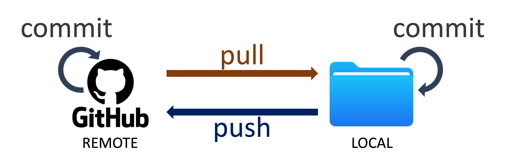

# GitHub Desktop Fundamentals
---
**_Learning Objectives_:**  
1. Understand why we use version control, Git, and GitHub
2. Learn basic terms used in GitHub, such as clone, commit, push, pull, and merge
3. Learn how to clone repositories, make changes, and update changes on local and remote repositories
4. Handle branches and resolve merge conflicts 
 ---
 🔔**Question**: Have you ever made a mistake of overwriting a file or saving the wrong version? 
 
## Version Control 
> Imagine that you’re collaborating with one of your labmates on a project. You’re both making changes to a document or a codebase. At one point, you both have changed the same lines in a particular document. How do you go about merging your changes?

This is why we use version control. **Version control** is a system that manages and records changes to files over time. The most commonly used version control system is called **Git** (others include Mercurial and SVN). `git` keeps track of the differences in the repository each time you make a change. The entire history of the repository is tracked by `git`. If you realize you made a mistake in your code, you can always roll it back to a previous time point.
 
  
 In the personal workflow, you are largely going to be the only person adding to the repository. You have one **branch**, or version of your project. It is called the `main` branch. Every time you make changes to the code, you'll add them tothe `main` branch. 

 ## GitHub
 `git` is often used in tandem with a cloud-based hosting platform - the most common is **GitHub** (but others include Gitlab and Bitbucket). GitHub is a hosting service for Git repositories. It allows you to store your Git projects in the cloud and provides a platform for collaborating with others. The benefit to using GitHub is that it makes it easier to collaborate on code with others via its web platform. 
 
In this lesson, we're going to use the [**GitHub Desktop Application**](https://desktop.github.com/download/) to make updates to a repository. [Documentation for GitHub Desktop](https://docs.github.com/en/desktop) can be found here.  
A **repository** (or repo for short) is a central place where all the files related to a project are stored. It includes your project’s code, documentation, and a record of every change made to the files over time, managed through a version control system like Git.  
💡**Tip**: Git and GitHub can be used through command line. We are focusing on GUI version of GitHub. 

## Managing Local and Remote Repositories
We need to make a distinction between two kinds of repositories: there's the local repository and the remote repository. **The local repository** is the version of the code that is stored on your computer. **The remote repository**, meanwhile, is any version of the repository that lies on some other machine. In this context, remote repository is almost always going to refer to the version that is on on Github's servers.  

So, when we're making changes to a repository, there's two versions that need to stay in sync with each other: the local and the remote. The steps we outline keep track of those changes between both cases, while also keeping track of the entire history. Github provides a nice platform on which we can peruse the history of a repository. 
  

1. **Commit**: Save your selected changes with a description.
2. **Push**: Upload your saved changes to GitHub for others to see.
3. **Pull**: Download the latest updates from GitHub to your project.
 
Let's go through the process of making changes to a repository, step by step. 
 
### 1. Creating a Repository 
To creating a new repository on Github, [link](https://docs.github.com/en/get-started/quickstart/create-a-repo) and follow the instructions on how to create a new repository on Github. Make sure to tick the `Add a README file` box under "Initialize this repository with". Click on `Create repository`. You now have a remote    repository (on Github's servers), but **not** a local repository. 

To create a new repository on GitHub Desktop, click `Current Repository`, and `add`. Click `Create New Repository`. Make sure to tick the "Initialize this repository with a README file". You now have a local repository but **not** a remote repository. `Publish repository` in order to put this newly created repository onto GitHub.  

🥊**Challenge**: Let's create a new repository under your account.  

### 2. **Cloning.** 
Cloning a repository means taking a remote repository, and copying it to our local machine to create a local repository. Under `Current Repository`, click `add`and select `Clone Repository`. You can clone your own repository or any publically avaialable repository.  
 
### 3. **Making a change.** 
GitHub Desktop automatically tracks changes. Whenever you make changes to the local repository, the changes will how up on the application.  
Let's make a change by creating a new file. Create a file called `text.txt`, which has some text in it of your choosing. 
🔔**Question**: Do you see these changes on your GitHub Desktop? 
 
### 4. **Committing a change.** 
Committing changes entails taking a snapshot of them: once we do this, the changes are frozen and placed in the `git` history. Each commit needs an accompanying message to say what the reason for the commit is. Make sure these messages are informative - your future self will thank you! 

### 5. **Pushing to the remote.** 
Right now, the local repo knows about the changes we did, but the remote repo doesn't. So, we need to synchronize the two by "pushing" our changes to the remote repo.  

### 6. Check Github
Let's check the GitHub page to see if the changes you made manifest on the website!  

So, even in the personal workflow, there's a lot of individual steps needed just to make changes to the codebase. This becomes a little bit more complicated when multiple people are making changes at the same time, which requires a slightly different workflow. 

 
## Collaborative Workflow 
 In the collaborative workflow, multiple people may be working on the same repository at the same time. So we need to have a system in place for how to decide whose changes to add, and how to handle scenarios when changes may clashwith each other. 
 Collaborative workflows heavily rely on **branching**. We've already seen this terminology in the context of the `main` branch. Now, we might be interested in adding a new feature to a code repository. When working collaboratively, we create a **branch** off the `main` repository. This branch can be updated in parallel, without modifying the `main` branch. When we've committed all the changes to the feature branch, how do we go about incorporating them into the`main` branch? 
  
 With Github, we do a **Pull Request** (PR). In a PR, we are requesting the `main` branch to pull the changes from the feature branch into the `main` branch. Github provides a very nice platform to handle PRs - users can view the PRs, comment on them, and ask for changes. Once the maintainer of the repo is satisfied, they can merge the PR and the `main` branch is updated with the changes in the feature branch. 
 The process of merging the changes in this way allows people to work in parallelon the `main` repo without modifying the `main` branch. Couple this with Github's platform for handling PRs, and you have a powerful tool for incorporating parallel changes into a repository. 
 Let's give this a shot! You are going to make a change to an existing repositoryand submit a pull request for it. We'll be working in a repository called`Git-Playground` which is available on the D-Lab Github at [thislink](https://github.com/dlab-berkeley/Git-Playground). 
 
1. **Forking the repository.** An extra step you can take when working on a   collaborative repository is to **fork** the repo. This creates a copy of the   repository on your own Github account, which you're free to change at will.   You can still, however, pull changes from the original repo, and make pull requests with your own changes. Go ahead and fork the repo that I just created. See the image below for where to find the button: 
  
 
2. **Cloning.** Clone the forked repo to your local machine. 
 
3. **Branching.** Create a new branch on your local machine using the command   `git checkout -b BRANCH_NAME` or `git branch -c BRANCH_NAME`.   Choose a branch name that feels appropriate to   you. Run `git status` afterward to see how things changed.   You can check out which branches you have, and which you are currently on,   by running `git branch`. 
 
4. **Commit a change.** Create a new file with some text, stage it, and commit   it. 

5. **Push the change.** Push the change on this branch to your remote repo.   You'll still use `git push`, but the command is slightly different: it will   be `git push origin BRANCH_NAME`. You're pushing to the remote (`origin`) on   the `BRANCH_NAME` branch. 

6. **Make the Pull Request.** Go to the `Git-Playground` repository on Github.   You should see something like the following image pop up. Github can already   tell you made a change, and gives you the option to make a pull request! If   you don't see this button, no worries - go to the "Pull Requests" button next   to Issues, and you can manually make one there. Follow the instructions for   making the pull request, and we'll merge a couple of them! 

  
 
# Removing git repositories 
 
* **Local:** If you want to delete local git-related information (like  branches and versions), all you have to do is delete the `.git` directory in  the root-directory of your repository. Note that `.git` directories are hidden  by default, so you'll need to be able to view hidden files to delete it.  If you want to delete everything (data, code, etc.), just delete the whole  directory. 
 
* **Remote** : If you want to delete a remote repository, navigate to GitHub andgo to Settings, then Danger Zone (at the bottom of the Settings page). Warning:Once you delete a repository, there is no going back. 
 
# Learning more 
 That's the workflow! There are other `git` practices we didn't cover - handlingmerge conflicts, rebasing, etc. As you get deeper into `git`, you can peruse theGithub documentation for tips on how to do these more advanced `git` commands.

 
 There are several different workflows in which you might imagine using `git`, particularly in an academic setting. These include: 
 
1. Working on a repository that is your own repo. You expect that you will generally be the only person developing code for this repository.  
2. Working on a repository that several people - perhaps some collaborators - are working on concurrently.  
3. Working on a repository that *many* people (e.g., at least dozens) are involved in. This may be, for example, an open-source project to which you contribute changes. We will not cover this approach in this workshop, as the details may be specific to the project you're working on. However, the principles from approach 
#2 hold here. 

## Personal Workflow 
  
 
 Each step in the Personal workflow is actually comprised of a set of smallersteps. Before we go through each step, we need to make a distinction between twokinds of repositories: there's the local repository and the remote repository.The local repository is easy: that's the version of the code that sits on yourcomputer. The remote repository, meanwhile, is any version of the repositorythat lies on some other machine. In this context, it's almost always going to refer to the version that sits on Github's servers. 
 
 
 
